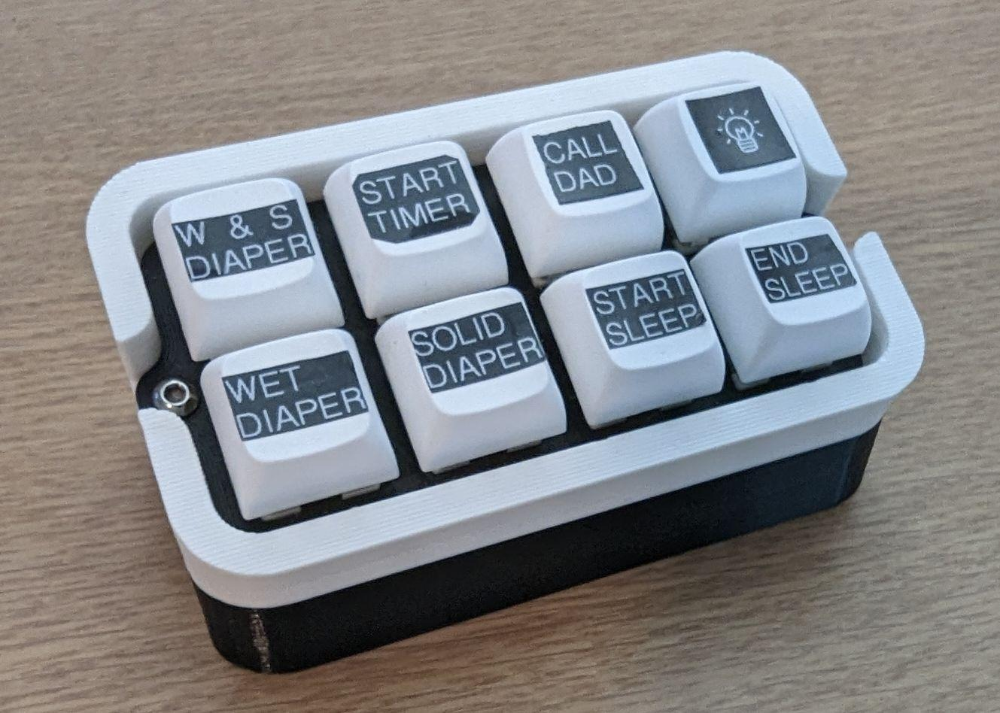
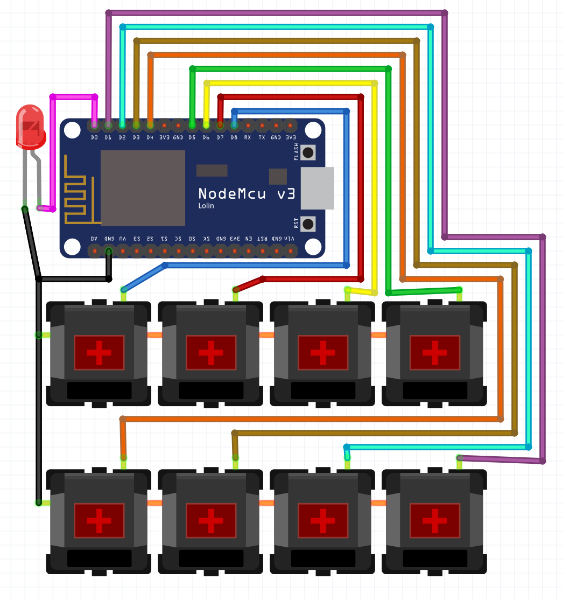
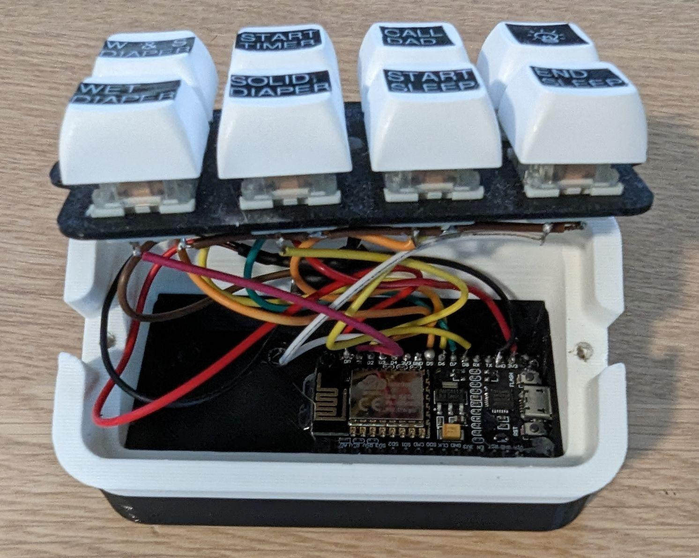

## Quick Entry Keypad for BabyBuddy and Home Assistant with ESPHome ##
 
I set up [Home Assistant](https://www.home-assistant.io/) to integrate with [BabyBuddy](https://github.com/babybuddy/babybuddy) with the [Baby Buddy Home Assistant Integration](https://github.com/jcgoette/baby_buddy_homeassistant). I made a quick little keypad for adding data to baby buddy through a NodeMCU with [ESPHome](https://esphome.io/).

It's a simple 8 switch keypad. In my use case it's used for Light Button, Call Dad Button and six BabyBuddy data points (solid diaper, wet diaper, solid & wet diaper, start sleep, end sleep and start a timer.).

#### Parts: ####
- 8 [Key Switches](https://amzn.to/3i8RcX6)
- 8 [Key Caps](https://amzn.to/3KHNKyS)
- a [nodeMCU / ESP8266 board](https://amzn.to/2JWhQF0)
- a [HomeAssistant installation](https://www.home-assistant.io/) with an ESPHome integration
- Printable enclosure [Base](BabyBuddyKeypad_Base_nodeMCU.stl) & [Faceplate](BabyBuddyKeypad_Faceplate.stl)

#### Assembly: ####

#### Programming: ####
- You'll need to be comfortable with [ESPHome](https://esphome.io/) and loading that code onto your Esp8266. The [ESPHome code](esphome_keypad.yaml) should work out of the box with just your Wi-Fi information. 
- Add the [Baby Buddy HA Integration](https://github.com/jcgoette/baby_buddy_homeassistant) if you haven't already. 
- Add the Automations to your HA configs. You'll need to copy them one by one from [automations.yaml](automations.yaml)
- You'll need to figure out your baby's entity ID number/name from HA for the automations to log correctly, and decide what notes will be helpful, and change the YAML as needed. You can figure this out by making a test service call from the HA developer section and see what the YAML shows you for entity_id
- Restart Home Assistant and you should be able to log data right away. 
